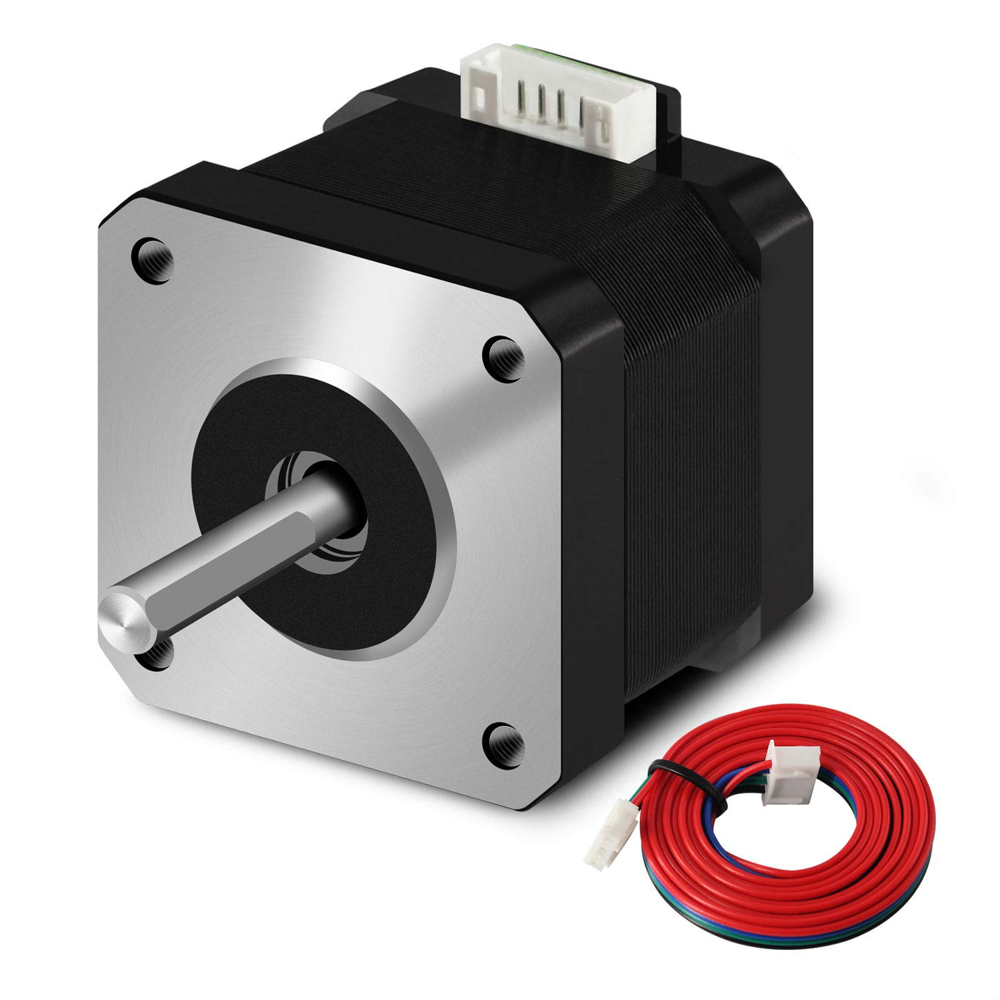

# TASK12.2- ROBOCON

## selecting **Motors for Robocon 25 Basketball-Themed Robots**

## 1)movement motors

- **Factors to Consider:**

Provide consistent propulsion for both robots.
Ensure precise and agile movement across the field.
Handle sudden stops, quick turns, and fast accelerations, as required in a basketball game.

- **Selection Criteria for Movement Motors**

The selection of movement motors is based on several performance factors critical to the success of the robots:

Torque: The motors must generate sufficient torque to move the robot’s body and any additional components (such as dribbling mechanisms)

Speed: High speed is necessary to compete effectively, especially when positioning the robot for offensive or defensive plays.

Load Capacity: The motors must be capable of moving the full weight of the robot, including batteries, controllers, and other components.

Power Efficiency: The motors should consume minimal power to ensure long battery life during the game.

Control: The motors should support fine control for agile movements, such as sharp turns or dodging opponents.

Durability: Robust motors are required to withstand the physical demands of competitive play

### Recommended Movement Motors :

After evaluating the requirements for the task, the following motor options are recommended based on their performance, reliability, and suitability for robotic applications.

 

1.  **DC Brushless Motors**
Model: TMotor U8 II
Type: Brushless DC Motor
Torque: High torque with a peak performance of 5.1 Nm
Speed: Adjustable speed through an Electronic Speed Controller (ESC), capable of reaching 6,000 RPM.
Efficiency: High power efficiency, which reduces power consumption and extends battery life during the match.
Control: Compatible with a wide range of motor controllers for precise, agile movement.
Advantages:
Brushless design for less maintenance.
Smooth and quiet operation with low heat generation.
Ideal for fast, dynamic movements required in basketball-like gameplay.
Use Case: The U8 II is particularly well-suited for powering the wheels of the robots, providing reliable forward and backward motion and quick response times when changing direction.

**2.DC Geared Motors**
Model: Pololu 37D 100:1 Metal Gearmotor
Type: DC Geared Motor
Torque: High torque output of 12.4 kg-cm at 12V, perfect for heavier robots or those requiring more traction.
Speed: With a gear ratio of 100:1, the motor provides moderate speed (150 RPM) while prioritizing torque.
Load Capacity: Designed to handle significant loads, making it perfect for larger robots that need to maintain steady movement while carrying additional weight (such as mechanisms for dribbling or shooting).
Control: Supports PWM (Pulse Width Modulation) control for smooth speed adjustments.

Advantages:
High torque allows for better control over acceleration and direction changes.
Metal gears provide durability and can handle physical impacts during the game.
Cost-effective option for competitive builds.
Use Case: Ideal for robots that require slow but powerful movements, especially during defensive maneuvers.

**3. Omni-Wheel Movement Motors**
Model: Andymark NeveRest Orbital 20
Type: DC Gearmotor for Omni-Wheels
Torque: 3.1 Nm, sufficient for driving omni-wheels, which allow for multidirectional movement.
Speed: A moderate speed of 350 RPM for effective, smooth control in any direction.
Efficiency: Designed for low power consumption with excellent responsiveness.
Control: Allows for precise control, critical for sharp turns and moving in multiple directions without needing to rotate the entire robot.
Advantages:
Perfect for maneuvering in all directions (lateral, diagonal) without rotating the robot’s body.
Provides fast adjustments when switching from offense to defense.
Reduces mechanical complexity by eliminating the need for turning motors.
Use Case: Omni-wheels driven by these motors would be optimal for agile robots that need to move laterally or quickly adjust position on the basketball court.

### Final Recommendation:

the Andymark NeveRest Orbital 20 motor paired with omni-wheels is recommended for overall movement
due to its ability to move in all directions without requiring the robot to turn.
This allows for greater agility and speed in a game scenario where positioning is crucial.
However, if the robot is designed to prioritize linear speed and torque,
the TMotor U8 II Brushless DC Motor is a great option for faster movement across the field.

## 2)Dribbling motors

### **Key Considerations for Selecting Dribbling Motors**

1. **Torque and Speed Balance**:
    - The motor must provide enough torque to maintain control over the ball, especially when moving at various speeds or changing directions quickly.
    - Speed is critical to simulate realistic dribbling motions, so you need a motor that can achieve the right balance between rapid oscillations and controlled movements.
2. **Precise Control and Responsiveness**:
    - Dribbling involves quick and precise actions, so the motor needs to respond instantly to control signals. Look for motors with high responsiveness and low latency.
    - Motors with fine control over speed adjustments can help achieve smooth dribbling actions.
3. **Compact Size and Weight**:
    - The dribbling mechanism must fit within the constraints of your robot’s design. Compact and lightweight motors are ideal to minimize the impact on the robot’s overall maneuverability.
    - Ensure the motor's weight does not destabilize the robot or affect other components.
4. **Durability and Reliability**:
    - The motor will be subject to continuous start-stop actions, vibrations, and possible impacts from the ball. It should be robust enough to handle repeated use without overheating or mechanical failure.
    - A reliable motor ensures consistent performance throughout the match.
5. **Integration with Control Systems**:
    - Ensure the motor is compatible with your robot’s control system, such as the microcontroller or motor driver you are using.
    - The motor should be easily programmable to adjust dribbling patterns and adapt to game scenarios.

**Specifications**:

- **Voltage**: 12V-24V
- **Torque**: 5-10 Nm (shooting) and 3-5 Nm (passing)
- **Speed**: 3000-5000 RPM (shooting) and 2000-3000 RPM (passing)

**Recommended Motors:** 

Shooting and passing require motors with high initial torque and speed to impart the necessary force onto the ball. Depending on the task, different motors might be suitable like :

1. **servo Motors**:
    - **Cons**: They are generally slower than other motors, so they may not provide the rapid back-and-forth motion required for high-speed dribbling.
    - **Use Case**: Ideal for controlled, low-speed dribbling or in situations where precise positioning is critical.
    - **type** :**HS-785HB Servo Motor**
    
    
    

1. **Stepper Motors**:
    - **Pros**: Stepper motors are highly accurate and provide excellent control over speed and positioning. They can achieve smooth dribbling motions by adjusting step increments.
    - **Cons**: They can be noisy, may require complex control algorithms, and consume more power compared to other types.
    - **Use Case**: Best for applications needing detailed, step-by-step control of the dribbling mechanism.
    - **type** : **NEMA 17 stepper motor**
    
    
    

## 3)Passing and Shooting Motors

- **Factors to Consider:**
1-Torque: High torque is needed for for shooting the ball to overcome the forces.
For passing, it may need lower torque if the ball is to be gently passed over a short distance.
2-Speed : High speed is essential for shooting to ensure the ball gains the necessary velocity & for passing the velocity is important but the precision is our interest.
3-Control :Both shooting and passing require precision. For passing, the motor must offer fine control for adjusting the ball's velocity.
- For shooting motor type according above requirements we suggest **Brushless DC motors** are suitable for shooting because:
1-They provide high RPM (5000-10000 RPM)
2-High torque with low gear ratio
3-High power rating (50-150W) and this varies according to the weight of the ball.
- For Passing motor type it requires less force but more control over the ball's speed and direction. We suggest DC motors with encoder feedback are suitable for passing because:
1-We need speed control and medium RPM. So, (2000-4000 RPM) could be sufficient. And with gear system to provide more control.
2-Lower torque but still enough to pass the ball over a reasonable distance. A motor with a medium torque rating (2-5 Nm) would typically suffice for passing.
3-Passing requires less power compared to shooting. Motors in the range of (10-50W) should be sufficient.

**Considerations to take when select the motor and edit in it Specs:**
1-Weight of the Ball: The size and mass of the ball influence the motor selection. Heavier balls require higher torque and power for both shooting and passing.
2-Distance of Shooting and Passing: If the robot needs to shoot over long distances.
Prioritize a motor with high power and speed. For passes, more controlled passes, prioritize precision and control.
3-Robot Power Supply: Ensure the motor is compatible with the robot’s power supply, considering voltage and current requirements.
4-Efficiency: Motors with higher efficiency will ensure longer battery life.

- **Examples for shooting motors:**
.Brushless DC Motor: 24V, 5000-10000 RPM, 3-10 Nm torque, 100W power.
.We suggest (Turnigy Aerodrive SK3 - 5055-280KV Brushless Outrunner). It supplies high power with high range & if we need to decrease it's power we can use gears.
- **Examples for passing motors:**
DC Motor with Encoder: 24V, 2000-4000 RPM, 2-5 Nm torque, 20-50W power. We suggest Pololu 37D Gearmotor with Encoder For fine control of passes.

**ABU ROBOCCON Rules**

[ABU_ROBOCON_2025_Rulebook_20240814 (1).pdf](ABU_ROBOCON_2025_Rulebook_20240814_(1).pdf)